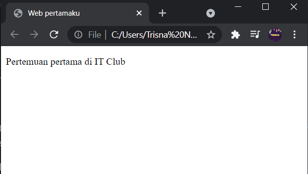
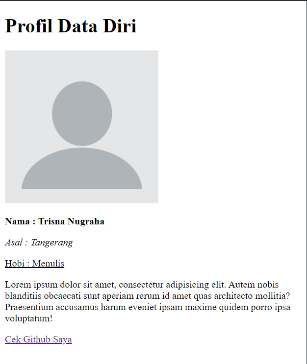
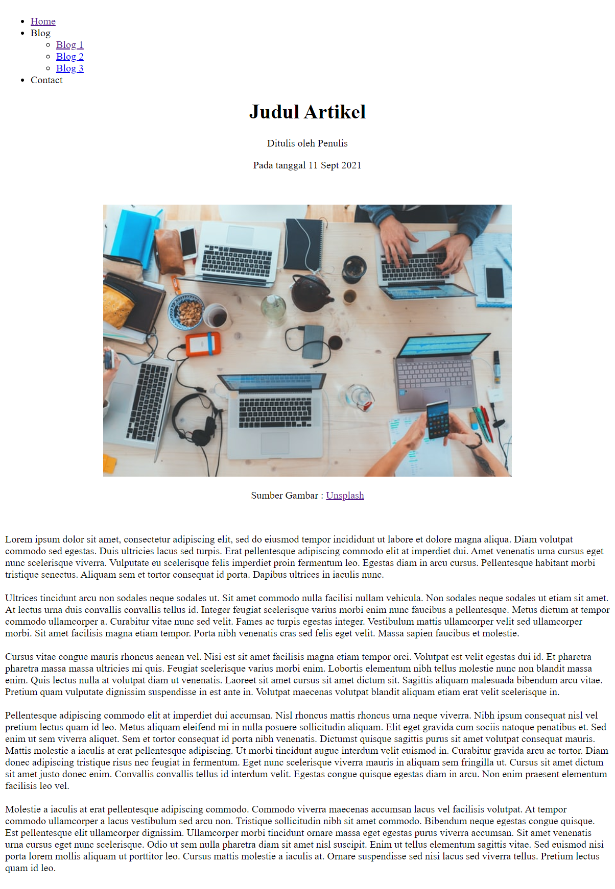
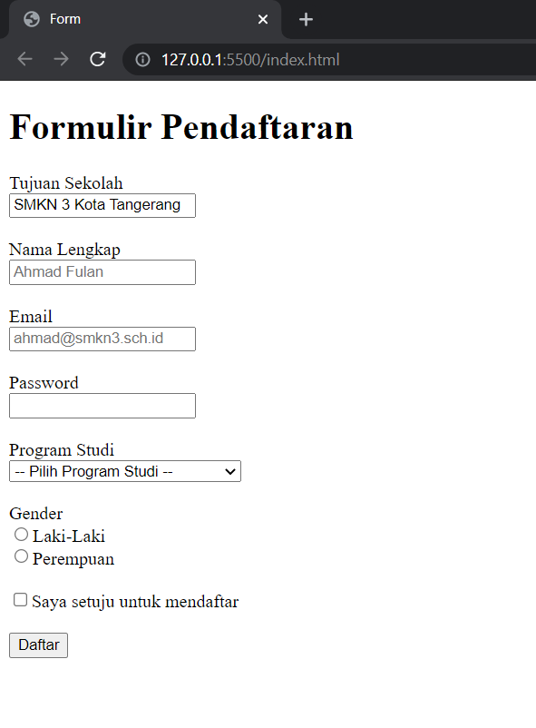

# Dokumentasi Web Dev 
## IT Club SMKN 3 Kota Tangerang
### By Trisna Nugraha

 

### Dibuat dengan :
- HTML5

 

### Deskripsi :
- [Pertemuan 1](https://github.com/trisnanugraha/it-club-repo/tree/master/pertemuan-1) : Belajar Struktur Dasar HTML
- [Pertemuan 2](https://github.com/trisnanugraha/it-club-repo/tree/master/pertemuan-2) : Halaman Profil Sederhana
- [Pertemuan 3](https://github.com/trisnanugraha/it-club-repo/tree/master/pertemuan-3) : Halaman Artikel Sederhana
- [Pertemuan 4](https://github.com/trisnanugraha/it-club-repo/tree/master/pertemuan-4) : Halaman Form Sederhana
- [Pertemuan 5](https://github.com/trisnanugraha/it-club-repo/tree/master/pertemuan-5) : Table Sederhana

 
 

# Preview
## Pertemuan 1

 

 

## Pertemuan 2

 

 

## Pertemuan 3

 

 

## Pertemuan 4

 

 

## Pertemuan 5

 

 